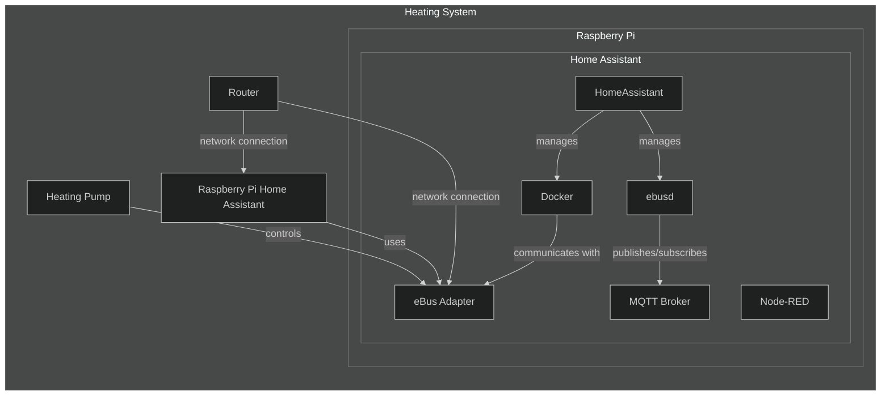

# Installation of eBus adapter with Home Assistant eBUSd AddOn to use with a "Ochsner GMWW 11 plus" heat pump

This repo is a fork from : https://github.com/Lorilatschki/ebusd-guide
This guide contains links to various websites. The operators themselves are responsible for their content.
I do not receive any compensation or payment for any of these links.

**19.02.2026: Configuration gmww11plus.csv , broadcast.csv and _templates.csv updated**

**This repository** describes how to setup a infrastructure to control a eBUS based heating pump with following parts:

 - **Ochsner GMWW 11 plus (OTE3)** (smaller and bigger GMWW models may also work)
 - **Home Assistant** (Open source home automation that runs on a Raspberry Pi or a local server)
 - **Step by step guide** (designed to help beginners to get their eBUSd adapter up and running in a reasonable amount of time)

For other Hard- and Software-Enviroments see the repos of [Uwe](https://github.com/cybersmart-eu/ebusd-ochsner) and [Lori](https://github.com/Lorilatschki/ebusd-guide) .
You can setup the same for every other eBUS based heating pump, the only difference are the ebusd specific configurations.

## Component overview

The heating system is composed of several interconnected components that work together to control and monitor the heating pump. 
The central control unit of this system is a Raspberry Pi with Home Assistant installed.
 
**IMPORTANT NOTE: In this configuration the eBUS Adapter(v5) is NOT INSTALLED onto RPi4, it is installed inside the heating pump as standalone adapter
and connected to the router via ethernet** This can also be done with adapter onboard Wifi, but in my case WiFi was not stable enough.  

## Components

- **Heating Pump:** The primary device responsible for circulating heat transfer fluid throughout the heating system.
- **eBus Adapter:** An interface device that enables communication between the heating pump and the Raspberry Pi. Buy it there.
    [eBUS Adapter](https://adapter.ebusd.eu/)
- **Router:** A network device that facilitates data communication between the Raspberry Pi, the eBus Adapter, and potentially other networked devices.
- **Home Assistant on Raspberry Pi** (or other Hardware): A compact computer that hosts a Home Assistant environment and serves as the brain of the system.
    It uses the eBus Adapter to interface with the heating pump.
    [Home Assistant Installation on RPI4](https://www.home-assistant.io/installation/raspberrypi/)
- **Some tools** Some tools to make your job easier
  
    ***WINSCP*** [WINSCP Download](https://winscp.net/eng/download.php)
  
    ***PUTTY***  [PUTTY Download](https://putty.org/)

## Home Assistant (HA) on Raspberry Pi

#### It is highly recommended to have sufficient knowledge how to install and operate Home Assistant prior to install and operate ebusd !! 
Within the Raspberry Pi, the Home Assistant host is running to manage and isolate different software components using internal(!) containers. **You don't need
knowledge about container handling!**
The software components in HA are called Add-On's or integrations.
The following Add-On's must be installed:

- **ebusd:** A daemon for handling communication with eBus devices like the heating pump. It interfaces with the eBus Adapter to control and monitor the pump.
    [Home Assistant eBUSd](https://www.home-assistant.io/integrations/ebusd/)
- **MQTT Broker:** A message broker that supports the MQTT protocol. It allows for efficient and reliable communication between Home Assistant and ebusd AddOn.
    [Home Assistant MQTT](https://www.home-assistant.io/integrations/mqtt)
- **Advanced SSH & Web Terminal** (to enter HA command-line via SSH)
    [Home Assistant Community Add-on](https://github.com/hassio-addons/addon-ssh)
- **Studio Code Server** or **File editor** (to edit configuration files and watch log files aso)
    [Home Assistant Community Add-on](https://github.com/hassio-addons/addon-vscode)
- Node-RED: Can be used, but not needed here (programming tool to create automation flows).
- Portainer: Can be used, but not needed here (management tool to manage the internal Docker containers).

## Network Connections

The Raspberry Pi and the eBus Adapter both connect to the network through the Router, enabling remote access and control. This setup allows for monitoring and managing the heating system from a networked computer or a smart device.
Home Assistant communicates with each other and with external devices through the MQTT Broker and eBus Adapter, creating a robust and flexible control system for the heating pump.

# Step by step guide

The following steps provide a step by step guide to setup such an environment from scratch.

1) [eBUS Adapter Shield v5](./docs/ebus_adapter.md)
2) [Raspberry Pi and Home Assistant](./docs/home_assistant_pi4.md)
3) [eBUSd on Home Assistant on RPi4](./docs/home_assistant_ebusd.md)
4) [MQTT Broker / MQTT Explorer](./docs/mqtt.md)
5) [Start and check eBUSd](./docs/home_assistant_ebus_2.md)
6) [Inspect MQTT Explorer](./docs/mqtt_explorer.md)
7) [Verify eBUS Adapter connection to heatpump](./dosc/ebus_adapter_2.md)
8) [Adjust ebusd](./docs/ebusd.md)
9) [Create Home Assistant dashboard](./docs/home_assistant_dashboard.md)
10) [ebusctl commands](./docs/ebusctl_commands.md)

#

#### Helpful links

The following links are very helpful and might help understanding different topcis

- [Home Assistant Installation on multiple OS](https://www.home-assistant.io/installation/)
- [Home Assistant Installation on RPI4](https://www.home-assistant.io/installation/raspberrypi/)
- [ebusd wiki](https://github.com/john30/ebusd/wiki)
- [eBUS Adapter Shield v5](https://adapter.ebusd.eu/v5/)
- [MQTT beginner’s guide](https://www.u-blox.com/en/blogs/insights/mqtt-beginners-guide#:~:text=MQTT%20is%20a%20publish%2Dand,topics%20handled%20by%20a%20broker.)

