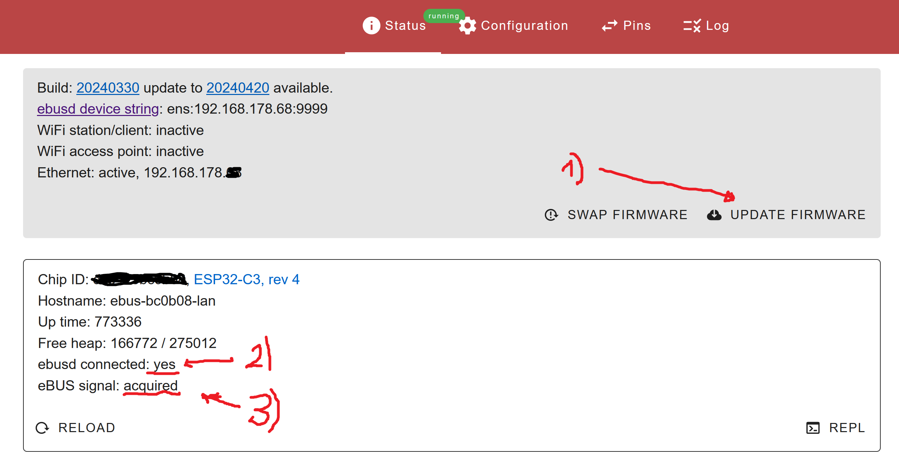

# Check Connection eBUS Adapter with heat pump

If you get problems in HA eBUSd protocol or you can't see values in MQTT, go back to the eBUS Adapter and do following checks:

**If you see problems here, solve these problems first, otherwise there is no point in trying the next steps**
#

**1) update Firmware to newest level and reboot adapter**

**2) confirm there is a connection to the Home assistant eBUSd AddOn**

**3) confirm the adapter is receiving signals from the bus**

#
**After all problems solved, proceed with next step** 
#
**[eBUSd Adjustments](ebusd.md)**

