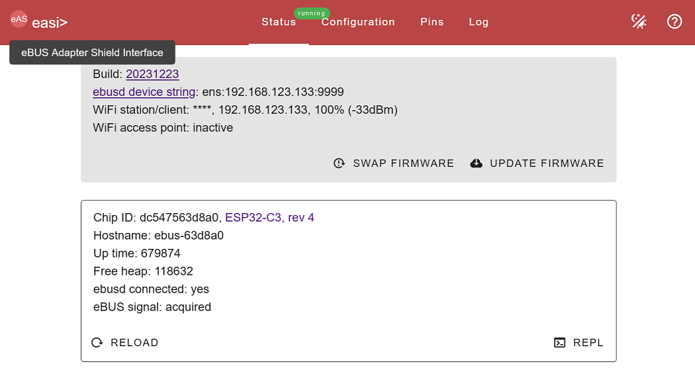

# Check Connection eBUS Adapter with heat pump

If you get problems to see values in MQTT. go back  

***Attention: the following description of the connection to my heat pump is without any warranty. Any interference with the heat pump may 
void the warranty! Only do this if you are aware of the risk and accept it.***

**How to wire the adapter with the heatpump ?**
- Shut down the heat pump to avoid electric problems
- Open the top cover of the heat pump
- Follow the 2-wire cable from the OCHSNER front control panel to the OTE adapter
- Connect your 2-wire cable in parallel with the OTE adapter connector in question
  (***Maybe 40, but CHECK CAREFULLY!***)
  
- Connect the USB-cable to power on the eBUS adapter
- Power on the heat pump.

# Configure eBUS Adapter with network

- Connect your pc to the WIFI access point with SSID "EBUS" (without password), which is started by the firmware after the first flashing
- use your browser at http://192.168.4.1

- define your network WiFi/Ethernet settings and reboot with new ip address
  

**Some things won't work at this point, but the network connection needs to work**
#
**Don't worry, proceed with next step** 
#
**[Home Assistant on RPi4](home_assistant_pi4.md)**

