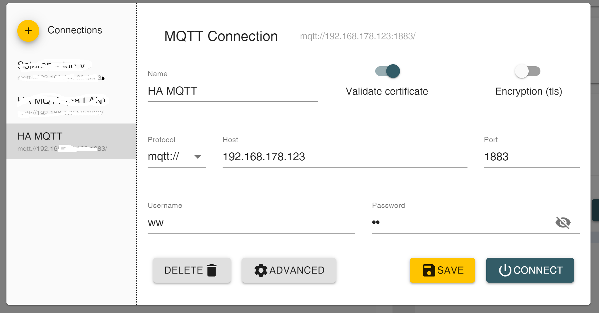

# MQTT Broker

MQTT is a standard messaging protocol designed specifically for use in IoT applications. It requires a so called MQTT broker.
The broker is at the heart of the system. It is responsible for receiving all messages, filtering them, and sending them to the subscribers, here the MQTT clients. An MQTT broker can potentially handle millions of connected MQTT clients.

**HowTO install MQTT Broker in HA** 
[Home Assistant MQTT integration](https://www.home-assistant.io/integrations/mqtt)
 

# MQTT Explorer

MQTT Explorer is a comprehensive MQTT client that provides a structured overview of your MQTT topics and makes working with 
devices/services on your broker dead-simple.

**HowTO install MQTT Explorer** :

1) as integration inside Home Assistant
[Home Assistant Addon MQTT Explorer new Version](https://community.home-assistant.io/t/addon-mqtt-explorer-new-version/603739)
2) as App in your private PC/Workstation/MAC aso
[MQTT Explorer Downloads](https://mqtt-explorer.com/)

# Configure MQTT Explorer

