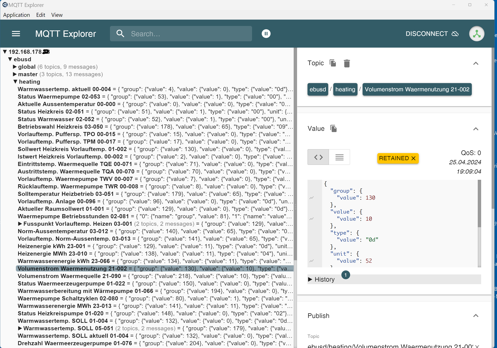

# MQTT Explorer 

**If everything has gone well so far, values will gradually appear in the MQTT explorer...**

**If no topics appear in mqtt explorer, the previous points must be checked again !! **

**proceed with next step** 
#
**[eBUSd Adjustments](ebusd.md)**
